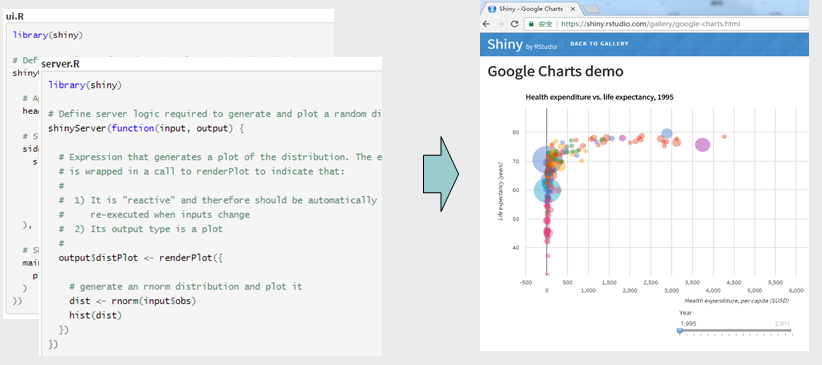
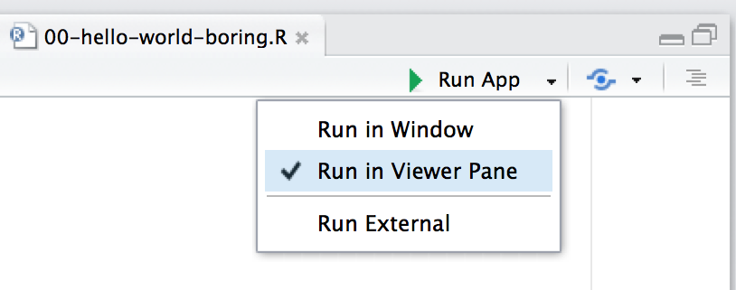
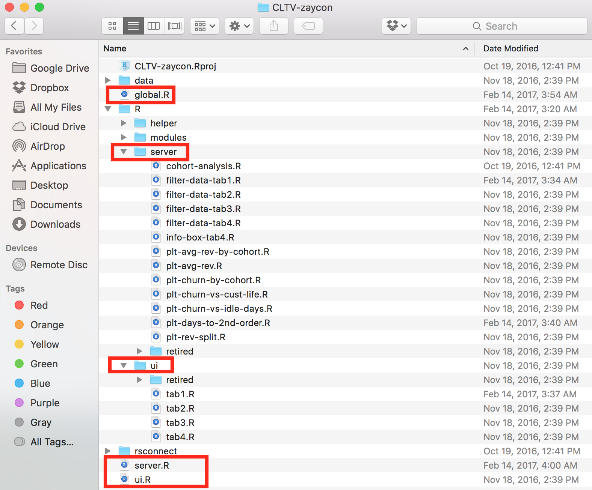
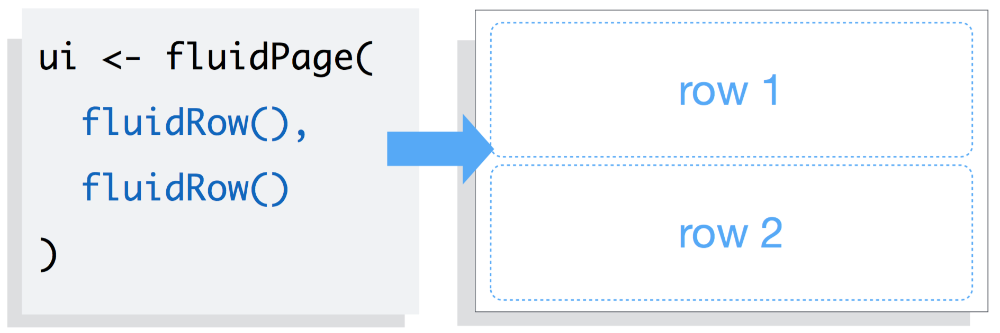
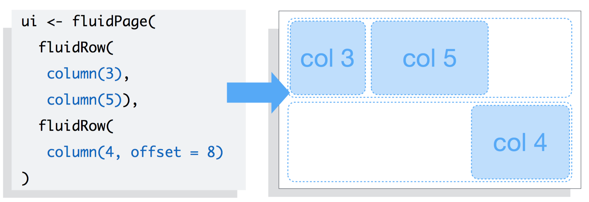
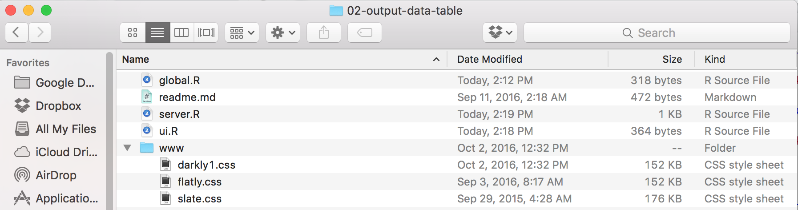
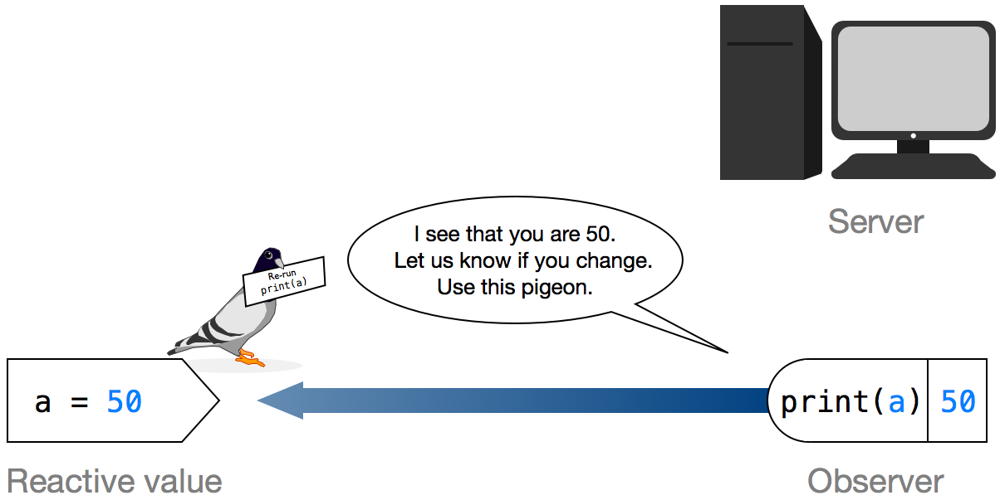
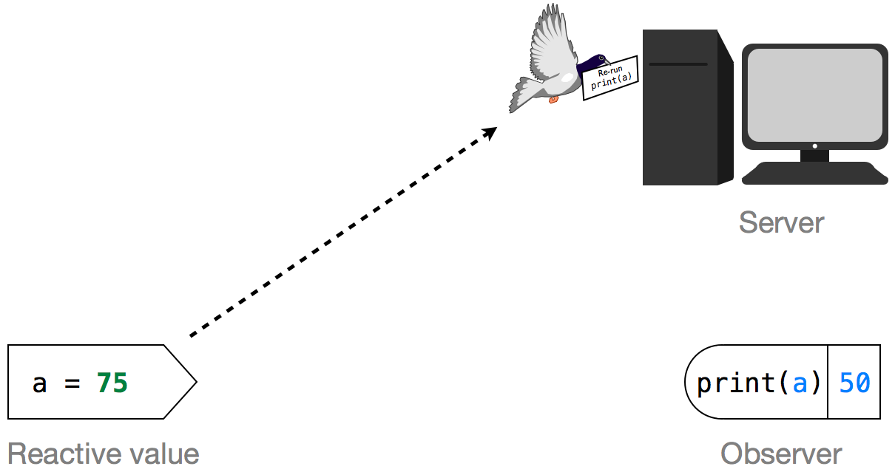
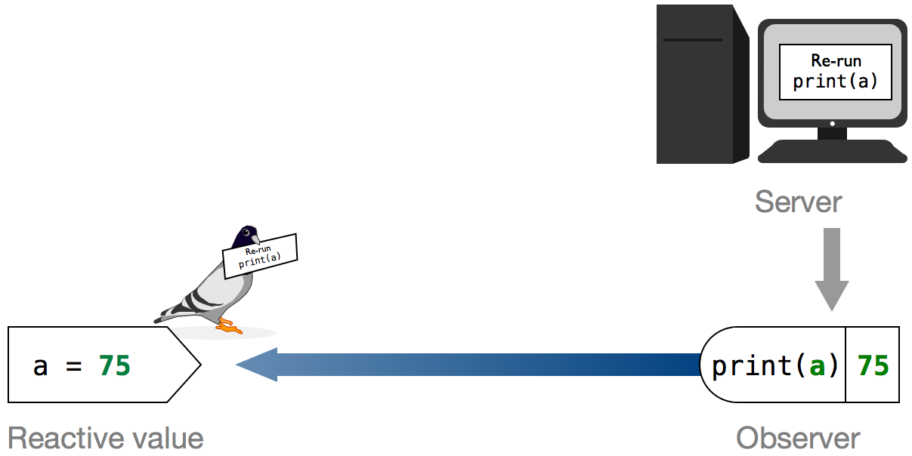
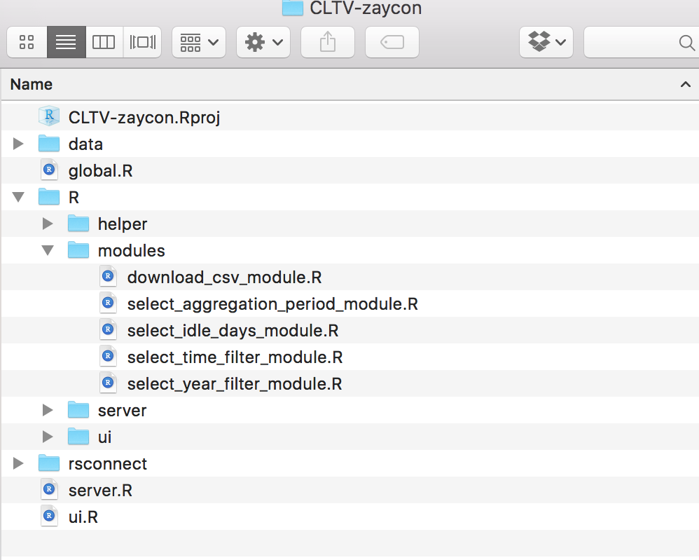

## Outline

> - 10 Minutes: Intro, setup and usecases
> - 55 Minutes: Shiny fundamentals
> - 15 Minutes: Shiny layouts
> - 70 Minutes: Reactive programming
> - 40 Minutes: Shiny modules

## Intro

---

## What is Shiny?

Shiny allows you to rapidly build web apps using R.



## Who is Shiny for?

> - Biostatisticians / Statisticians
> - Data scientists
> - R programmers

## Why should you care? 

>- Improve productivity
>- Broaden userbase
>- Tell data stories


## Demo

---

## RShiny usecases

1. Turn your ideas into reality. For example, this [app](https://cabaceo.shinyapps.io/tabelog-en/) provides a cleaner interface to search restaurants on Tabelog in English. 

2. Shiny App could be used to construct a very complaicated website. For example, this website is a one-stop shop for all information about tourism in New Zealand [[APP]](https://mbienz.shinyapps.io/tourism_dashboard_prod/).

3. [More](https://shiny.rstudio.com/gallery/) [examples](https://www.showmeshiny.com).

## Setup

---

## Install dev tools

> - [R](https://www.r-project.org)
> - [Rstudio](https://www.rstudio.com/products/rstudio/download/)
> - Web browser (Safari, Chrome or Firefox)

## Install R packages

```r
pkgs = c("shiny", "shinydashboard", "tidyverse", "plotly")
for (pkg in pkgs) {
        if (!pkg %in% installed.packages()) {
                cat(paste(pkg, "missing, will attempt to install\n"))
                install.packages(pkg)
        } else cat(paste(pkg, "installed OK\n"))
}
```

## Hello World!

> - Click the arrow next to **Run App** -> check **Run in Viewer Pane** 

This will open the app inside Rstudio. If you want to open the app in browser,
check **Run External** instead.
> - Click **Run App**.

## Hello World! code

```r
library(shiny)

# make UI ---
ui <- fluidPage(
        titlePanel("Hello World!")
)

# make server ---
server <- function(input, output) {}

# make Shiny app ----
shinyApp(ui = ui, server = server)
```

## Introduce yourself

> - Add an input box to let people enter their names. 
> - Output a sentence to say hello to the world.

Run <font color="blue">examples/01-hello-world.R</font>.

## Code

```r
# make UI ---
ui <- fluidPage(
        titlePanel("Hello World!"),
        mainPanel(
                textInput("my_name", 
                          label = "Enter your name:", 
                          value = "Harry"),
                textOutput("self_intro")
        )
)

# make server ---
server <- function(input, output) {
        output$self_intro = renderText(
                paste("My name is", input$my_name)
        )
}
```

## Use sidebar 

Run <font color="blue">examples/01-hello-world-w-sidebar.R</font>

## Code

```r
ui <- fluidPage(
        titlePanel("Hello World!"),
        
        sidebarLayout(
                sidebarPanel(
                        textInput("my_name", 
                                  label = "Enter your name:", 
                                  value = "Harry")
                        ),
                
                mainPanel(
                        textOutput("self_intro")
                )
        )
        
)
```

## Basic structure of shiny app

---

## UI

>- fluidPage()
>    - sidebarLayout()
>        - sidebarPanel()
>            - textInput()
>            - numericInput()
>        - mainPanel()
>            - textOutput()
>            - plotOutput()


## server

```r
server <- function(input, output) {
        1. takes user supplied values from input
        2. run computation
        3. return or display results through output
            - renderText()
            - renderPlot()
}
```

## Exercise 1

Make a shiny app that 

> - draws a histogram of some made-up data, and
> - lets users specify the number of bins.

Open <font color = "red">exercises/01-plot-histogram.R</font>. The server
function is already completed. We need to finish the ui. 

## Exercise 2

Make a shiny app that 

> - draws a histogram of Petal.Length in the iris data, and 
> - lets user choose the number of bins (min = 1, max = 50, value = 30) using a slider (?sliderInput()) 

You have 4 minutes.

## Exercise 3

Make a shiny app that

> - adds a scatter plot of Sepal.Length vs Sepal.Width, and
> - adds a text input box to allow user to supply a plot title. 

You have 8 minutes.

## Create a project for big shiny app 



## Example global.R snippet

```r
library(shiny)
library(shinyjs)
library(dplyr)
library(ggplot2)

# change max upload file size to 30 MB, default is 5 MB
options(shiny.maxRequestSize = 30*1024^2, shiny.reactlog = T)

# set paths
helper_path = "R/helper"
ui_path = "R/ui"
server_path = "R/server"

# load helper functions
for (fname in list.files(helper_path)) 
        source(file.path(helper_path, fname))
```

## Example ui.R snippet

```r
ui <- fluidPage(theme = "darkly.css", id = "navbar",
                     ...
     tabPanel(title = "Fake",
              uiOutput("hclust_filter"),        
              uiOutput("hclust_num"),
              actionButton("run_hclust", "Run"),
              plotOutput("dendrogram", height = "600px"),
              downloadButton('download_plt_hclust', "Download Plot")
     )
     ...
)
```

## Example server.R snippet

```r
server <- function(input, output) {
        # load ui related source files
        source(file.path(ui_path, "ui-simulate.R"), local=T)
        source(file.path(ui_path, "ui-simulate-allon-alloff-buttons.R"), local=T)
        
        # load server related source files
        source(file.path(server_path, "01-load-n-prep-data.R"), local=T)
        source(file.path(server_path, "02-simulate.R"), local=T)
}
```


## Share Shiny Apps within BI 

Currently, BI central RShiny is using a temporary server


## Shiny layout

## Layout Functions

> - `fluidRow()`
> - `column()`

## `fluidRow()`



<font size=2>credit: [Garrett Grolemund](https://www.rstudio.com/resources/webinars/how-to-start-with-shiny-part-3/)</font>

## `column()`



<font size=2>credit: [Garrett Grolemund](https://www.rstudio.com/resources/webinars/how-to-start-with-shiny-part-3/)</font>

## Example

```r
fluidRow(
        column(width = 4, 
               textInput("name", 
                         label = "Enter your name:", 
                         value = "Harry")
        ),
        column(width = 6,
               textInput("title", 
                         label = "Enter your job title:", 
                         value = "Senior Biostatistician")
        )       
)
```

##

```r
fluidRow(
        column(width = 4, offset = 8,
               selectInput("hobby", 
                           "Choose your hobbies:", 
                           choices = c('Reading', 'Singing', 
                                       "Watching Movies", "Swimming", 
                                       "Dancing", "Running", 
                                       "Working out", "Photography"),
                           multiple = T,
                           selected = c("Reading", "Swimming")
                )
        )
)
```

## Include the theme 

If you know some css and js, you can do something fancy with shiny.




## Reactive Programming

---

## Exercise

>- Open the file <font color="blue">exercises/04-reactivity-00.R</font>
>- Complete the server function so the app plots the first nrows of `cars`. So basically, make the Shiny equivalent of `plot(head(cars, nrows))`.
> - 2 minutes

<font size=2>credit: [Joe Cheng](https://www.rstudio.com/resources/videos/effective-reactive-programming/)</font>

## Solution

```r
output$plot <- renderPlot({
        plot(head(cars, input$nrows))
})
```

## Reactive Sources and Endpoints

```r
output$plot <- renderPlot({
        plot(head(cars, input$nrows))
})
```

|           |Role             |Implementation (R)         |
|-----------|-----------------|---------------------------|
|input$nrows|Reactive source  |Reactive value             |
|output$plot|Reactive endpoint|Observer ( renderPlot({}) )|


## Example: Fibonacci

This app finds the nth Fibonacci number and its inverse. I have two implementations. Both are pretty slow because they use recursion. But one is 
slower than the other because it didn't implement reactivity correctly.

## Slower Version

```r
server <- function(input, output) {
        # run fib() twice 
        output$nth_fib <- renderText({ fib(input$n) })
        output$nth_fib_inv <- renderText({ 1 / fib(input$n) })
}
```
Running the recursive function `fib()` twice makes the app very inefficient.

## Faster Version

```r
server <- function(input, output) {
        # only run fib() once
        current_fib <- reactive({ fib(input$n) })
        
        output$nth_fib <- renderText({ current_fib() })
        output$nth_fib_inv <- renderText({ 1 / current_fib() })
}
```
The amount of computation is reduced by adding a reactive conductor `current_fib()` in between the source and endpoints. The reactive expression `reactive({})` caches the value returned by `fib()` to make the app run more efficient.

## Terminologies Table

|Role              |Implementation (R) |
|------------------|-------------------|
|Reactive source   |Reactive value     |
|Reactive conductor|Reactive expression|
|Reactive endpoint |Observer           |

Source -> Conductor1 -> Conductor2 ... -> Endpoint


## Reactive Expression vs. Observer

|             |Reactive Expression |Observer             |
|-------------|--------------------|---------------------|
|R code       |`reactive({})`      |`observe({})`        |
|             |                    |`renderText({})`     |
|             |                    |`renderPlot({})`     |
|             |                    |`renderDataTable({})`|
|             |                    |...                  |

> - Reactive expression: always returns a value
> - Observer: never returns any values, instead, performs side effects, e.g., `render*({})` expressions make objects to display

## Exercise 1

Open <font color="blue">exercises/04-reactivity-01.R</font>

Re-write the server logic to ensure `head()` is only run once for every
change to `input$nrows`.

> - 3 minutes

<font size=2>credit: [Joe Cheng](https://www.rstudio.com/resources/videos/effective-reactive-programming/)</font>

## Solution

```r
server <- function(input, output) {
        
        df <- reactive({
                head(cars, input$nrows)
        })
        
        output$plot <- renderPlot({
                plot(df())
        })
        
        output$table <- renderTable({
                df()
        })
}
```

## Exercise 2

Open <font color="blue">exercises/04-reactivity-02.R</font>

Run it and it works. The problem is that each of the 4 outputs contains 
copied-and-pasted logic for selecting the chosen variables, and for building
the model. Can you refactor the code so it's more efficient and maintainable?

>- 6 minutes

<font size=2>credit: [Joe Cheng](https://www.rstudio.com/resources/videos/effective-reactive-programming/)</font>

## Solution

```{r, eval=FALSE}
selected <- reactive({
        iris[, c(input$xcol, input$ycol)]
})

model <- reactive({
        lm(paste(input$ycol, "~", input$xcol), selected())
})
```


## How does reactivity work?

```r
server <- function(input, output) {
        output$text <- renderText({
                print(input$a)
        })
}
```

## `print()`

```r
a = 50
print(a)

a = 75 # this action makes print(a) "out of date"

# to update "print(a)", just re-run it
print(a)
```

## Systym of Alert

ALerts are like carrier pigeons.



<font size=2>credit: [Rstudio](https://shiny.rstudio.com/articles/understanding-reactivity.html)</font>

## 



<font size=2>credit: [Rstudio](https://shiny.rstudio.com/articles/understanding-reactivity.html)</font>

## 



<font size=2>credit: [Rstudio](https://shiny.rstudio.com/articles/understanding-reactivity.html)</font>


## Prevent reactivity with isolate()

```r
output$self_intro = renderText({
        paste("My name is", isolate(input$my_name))      
})
```

## Trigger code with observeEvent()

```r
ui <- fluidPage(
        sidebarPanel( actionButton("btn", "Plot") )
        )
        
server <- function(input, output) {
        observeEvent(input$btn, {
                output$hist <- renderPlot({
                        bins <- seq(min(x), max(x), 
                                    length.out = isolate(input$bins) + 1)
                        hist(x, breaks = bins, col = "#75AADB", border = "white")
                })
        })
}
```
Through `actionButton()` users gain more control and can decide when the app should react.

## You now know

> - What is reactivity?
> - How does reactivity work?
> - How to code reactivity?
> - How to prevent reactivity?


## Shiny Modules

---

## What is a function?

A bag of code that takes some inputs and 

> - returns something, or 
> - performs some side effects, for example, `print()`, or
> - does both.

## Why use functions?

> - isolate
> - re-use 

## What is a module?

2 functions: 

> - Module UI creates UI elements
> - Module Server defines server logic

## Let's start with a simple example

```r
ui <- fluidPage(
        sliderInput("a", 
                    label = "Slide me",
                    min = 0, max = 100, value = 50),
        textOutput("num")
)

server <- function(input, output) {
        output$num <- renderText({
                print(input$a)
        })
}

shinyApp(ui = ui, server = server)
```

## How to add module UI

```{r, eval = F}
slider_ui <- function() {
        tagList( # use tagList to generate HTML code
                sliderInput("a", 
                            label = "Slide me",
                            min = 0, max = 100, value = 50),
                textOutput("num")
        )
}
        
ui <- fluidPage(
        slider_ui()
)
```

## Live Coding: write modules

Switch to Rstudio.

Work on the file <font color="blue">examples/06-modules-slider.R</font>.

## How to create ids for Module UI function

```{r, eval = F}
slider_ui <- function(id) {
        # id: string
        
        ns <- NS(id)
        tagList(
                sliderInput(ns("slider"), "Slide me", 0, 100, 1),
                textOutput(ns("num"))
        )
        
} 


ui <- fluidPage(
        slider_ui("slider_harry")
)

```


## Module server

Now that we’ve got module UI function, we can turn attention to the server logic

```{r, eval = F}
slider <- function(input, output, session) { # must have session
        output$num <- renderText({ input$slider })
}

server <- function(input, output) {
        callModule(slider, "slider_harry")
}

```


## Live Coding: use `NS()` to add 2 sliders

Switch to Rstudio.

Keep working on <font color="blue">examples/06-modules-slider.R</font>.


## Exercise 1

Use module to re-implement the hello-world example: <font color="blue">exercises/05-module-hello-world.R</font>.

> - 8 mins

## Exercise 2

You can now easily add another input boxes to your app (one id="you" and the other id="me").

> - 2 mins

## Where to define modules?




## Where to go next?

---

## Resources

> - [R style guide](http://style.tidyverse.org).
> - Rstudio's guided [tutorial](https://shiny.rstudio.com/tutorial/) for beginners.
> - Rstudio's technical [articles](https://shiny.rstudio.com/articles/).
> - [Shiny github page](https://github.com/rstudio/shiny).
> - [Shiny Google group](https://groups.google.com/forum/#!forum/shiny-discuss).
> - [>100 shiny app examples with code](https://github.com/rstudio/shiny-examples).
> - [Shiny developer conference videos 2016](https://www.rstudio.com/resources/webinars/shiny-developer-conference/).
> - [Shiny Modules](https://shiny.rstudio.com/articles/modules.html)
