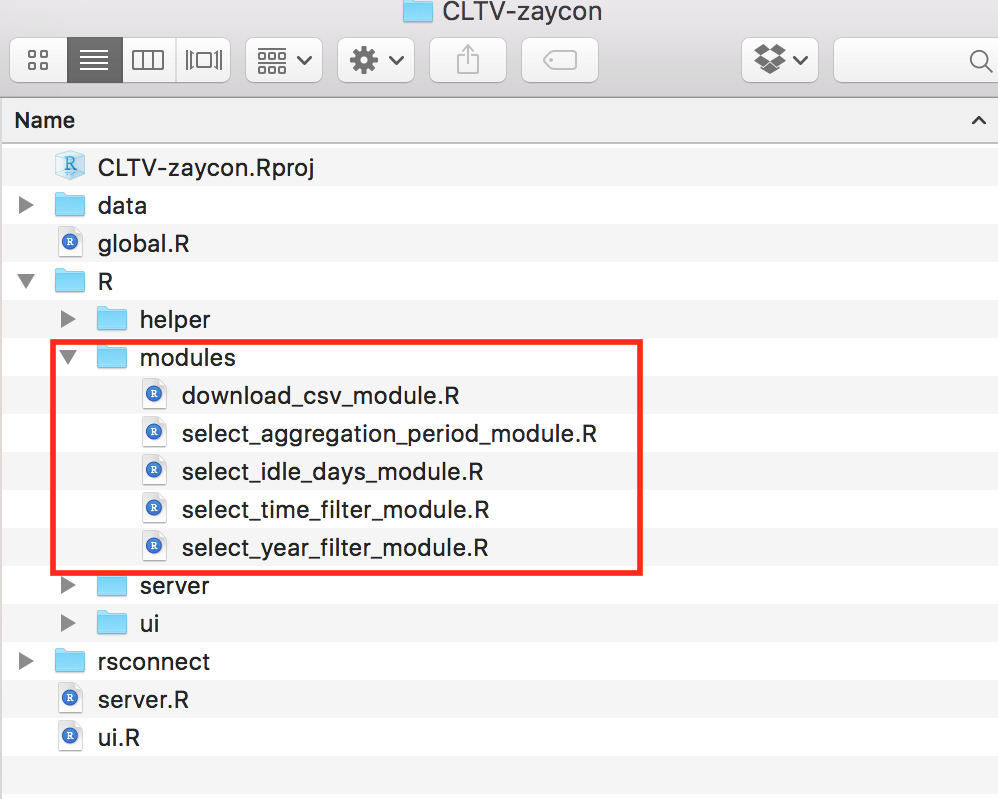

## Outline

> - 10 Minutes: Intro, setup and usecases
> - 50 Minutes: Shiny fundamentals 
> - 70 Minutes: Reactive programming
> - 10 Minutes: Shiny layouts
> - 40 Minutes: Shiny modules

## Intro

---

## What is Shiny?

Shiny allows you to rapidly build web apps using R.


## Who is Shiny for?

> - Biostatisticians / Statisticians
> - Data scientists
> - R programmers

## Why should you care? 

>- Improve productivity
>- Broaden userbase
>- Tell data stories


## Demo

---

## RShiny usecases

1. Turn your ideas into reality. For example, this [app](https://cabaceo.shinyapps.io/tabelog-en/) provides a cleaner interface to search restaurants on Tabelog in English. 

2. Shiny App could be used to construct a very complaicated website. For example, this website is a one-stop shop for all information about tourism in New Zealand [[APP]](https://mbienz.shinyapps.io/tourism_dashboard_prod/).

3. [More](https://shiny.rstudio.com/gallery/) [examples](https://www.showmeshiny.com).

## Setup

---

## Install dev tools

> - [R](https://www.r-project.org)
> - [Rstudio](https://www.rstudio.com/products/rstudio/download/)
> - Web browser (Safari, Chrome or Firefox)

## Install R packages

```r
pkgs = c("shiny", "shinydashboard", "tidyverse", "plotly")
for (pkg in pkgs) {
        if (!pkg %in% installed.packages()) {
                cat(paste(pkg, "missing, will attempt to install\n"))
                install.packages(pkg)
        } else cat(paste(pkg, "installed OK\n"))
}
```

## Hello World!

> - Click the arrow next to **Run App** -> check **Run in Viewer Pane** 

This will open the app inside Rstudio. If you want to open the app in browser,
check **Run External** instead.
> - Click **Run App**.

## Hello World! code

```r
library(shiny)

# make UI ---
ui <- fluidPage(
        titlePanel("Hello World!")
)

# make server ---
server <- function(input, output) {}

# make Shiny app ----
shinyApp(ui = ui, server = server)
```

## Introduce yourself

> - Add an input box to let people enter their names. 
> - Output a sentence to say hello to the world.

Run <font color="blue">examples/01-hello-world.R</font>.

## Code

```r
# make UI ---
ui <- fluidPage(
        titlePanel("Hello World!"),
        mainPanel(
                textInput("my_name", 
                          label = "Enter your name:", 
                          value = "Harry"),
                textOutput("self_intro")
        )
)

# make server ---
server <- function(input, output) {
        output$self_intro = renderText(
                paste("My name is", input$my_name)
        )
}
```

## Use sidebar 

Run <font color="blue">examples/01-hello-world-w-sidebar.R</font>

## Code

```r
ui <- fluidPage(
        titlePanel("Hello World!"),
        
        sidebarLayout(
                sidebarPanel(
                        textInput("my_name", 
                                  label = "Enter your name:", 
                                  value = "Harry")
                        ),
                
                mainPanel(
                        textOutput("self_intro")
                )
        )
        
)
```

## Basic structure of shiny app

---

## UI

>- fluidPage()
>    - sidebarLayout()
>        - sidebarPanel()
>            - textInput()
>            - numericInput()
>        - mainPanel()
>            - textOutput()
>            - plotOutput()


## server

```r
server <- function(input, output) {
        1. takes user supplied values from input
        2. run computation
        3. return or display results through output
            - renderText()
            - renderPlot()
}
```

## Exercise 1

Make a shiny app that 

> - draws a histogram of some made-up data, and
> - lets users specify the number of bins.

Open <font color = "red">exercises/01-plot-histogram.R</font>. The server
function is already completed. We need to finish the ui. 

## Exercise 2

Make a shiny app that 

> - draws a histogram of Petal.Length in the iris data, and 
> - lets user choose the number of bins (min = 1, max = 50, value = 30) using a slider (?sliderInput()) 

You have 4 minutes.

## Exercise 3

Make a shiny app that

> - adds a scatter plot of Sepal.Length vs Sepal.Width, and
> - adds a text input box to allow user to supply a plot title. 

You have 8 minutes.

## Create a project for big shiny app 


## Example global.R snippet

```r
library(shiny)
library(shinyjs)
library(dplyr)
library(ggplot2)

# change max upload file size to 30 MB, default is 5 MB
options(shiny.maxRequestSize = 30*1024^2, shiny.reactlog = T)

# set paths
helper_path = "R/helper"
ui_path = "R/ui"
server_path = "R/server"

# load helper functions
for (fname in list.files(helper_path)) 
        source(file.path(helper_path, fname))
```

## Example ui.R snippet

```r
ui <- fluidPage(theme = "darkly.css", id = "navbar",
                     ...
     tabPanel(title = "Fake",
              uiOutput("hclust_filter"),        
              uiOutput("hclust_num"),
              actionButton("run_hclust", "Run"),
              plotOutput("dendrogram", height = "600px"),
              downloadButton('download_plt_hclust', "Download Plot")
     )
     ...
)
```

## Example server.R snippet

```r
server <- function(input, output) {
        # load ui related source files
        source(file.path(ui_path, "ui-simulate.R"), local=T)
        source(file.path(ui_path, "ui-simulate-allon-alloff-buttons.R"), local=T)
        
        # load server related source files
        source(file.path(server_path, "01-load-n-prep-data.R"), local=T)
        source(file.path(server_path, "02-simulate.R"), local=T)
}
```


## Share Shiny Apps within BI 

Currently, BI central RShiny is using a temporary server


## Reactive Programming

---

## Exercise

Let's start with an exercise. Open the <font color="blue">04-reactivity-00.R</font> 
file under the `/exercises` folder. Your task is to complete the server function
so that the app shows a simple plot of the 1st nrows of `cars`, a built-in data
frame. Let me run the app so that you see how it works. 

**Run** <font color="blue">solutions/04-reactivity-00.R</font>. 

We see as we change the number of rows, the scatter plot updates accordingly.
This is what we call **reactivity**. Go ahead start. You have 2 minutes.

<font size=2>credit: [Joe Cheng](https://www.rstudio.com/resources/videos/effective-reactive-programming/)</font>

## Solution

Ok. Time is up. Raise your hand if you get something like this.

```r
output$plot <- renderPlot({
        plot(head(cars, input$nrows))
})
```

Congratulations! You've just implemented reactivity. Workshop is over and you 
all can go to dinner now. Yeah, I wish reactivity is that simple. Unfortunately,
it's not, so we'll have to work harder. But the payoff will be huge as reactivity is the single most important piece of shiny. When you make a complex shiny app 
that works but works very slowly, 99% of the time it's because you didn't 
implement reactivity correctly. 

## Reactive Sources and Endpoints

Let's break down the solution we just saw and learn some reactive terms.

`input$nrows` plays the role of source, and it's implemented in R by something 
called Reactive value. Reactive values implement reactive sources.

`output$plot` plays the role of endpoint, and it's implemented in R by something
called Observer, specifically, `renderPlot`. Observers implement reactive endpoints.

The example here has the simplest structure of a reactive program involves just a source and an endpoint.

|           |Role             |Implementation (R)         |
|-----------|-----------------|---------------------------|
|input$nrows|Reactive source  |Reactive value             |
|output$plot|Reactive endpoint|Observer ( renderPlot({}) )|


## Example: Fibonacci

Let's look at another example. This app finds the nth Fibonacci number and its 
inverse. I have two implementations. Both are pretty slow because they use 
recursion. But one is slower than the other because it didn't implement 
reactivity correctly.

The default example is to find the 32nd fibnacci number. Let me show them and record the time.

** SKIP WHEN NO TIME **

Let's first run the slower version. 

**Run** <font color="blue">examples/03-reactivity-fibonacci-slow.R</font>. 

Let's run the faster version. 

**Run** <font color="blue">examples/03-reactivity-fibonacci-fast.R</font>. 

<font size=2>credit: [Reactivity - An overview](https://shiny.rstudio.com/articles/reactivity-overview.html)</font>

** SKIP WHEN NO TIME **

What leads to the difference?

## Slower Version

Let's look at the slower version in detail. `fib()` is the recursive 
function for calculating the nth Fibonacci number. Notice we pass the source
`input$n` into `fib()` twice. We also used the observer `renderText({})`
twice and directed the rendered text to the endpoints `output$nth_fib`
and `output$nth_fib_inv` respectively.

```r
server <- function(input, output) {
        # run fib() twice 
        output$nth_fib <- renderText({ fib(input$n) })
        output$nth_fib_inv <- renderText({ 1 / fib(input$n) })
}
```
Running the recursive function `fib()` twice makes the app very inefficient.

## Faster Version

Let's now look at the faster version in detail. Notice we pass the source
`input$n` into `fib()` only once here. And we put `fib(input$n)`
inside of `reactive({})`. `reactive({})` is a **reactive expression**. It caches 
the value returned by `fib()` so that no matter how many times `current_fib()` 
is called, as long as `input$n` doesn't change, it'll simply look up the 
value instead of calling `fib()` to re-compute it. Please note that when calling `current_fib()`, you should add parenthesis behind it. 

```r
server <- function(input, output) {
        # only run fib() once
        current_fib <- reactive({ fib(input$n) })
        
        output$nth_fib <- renderText({ current_fib() })
        output$nth_fib_inv <- renderText({ 1 / current_fib() })
}
```

## Terminologies Table

We can now complete the table of reactive terminologies. There are three kinds
of objects in reactive programming: reactive sources, reactive conductors, and
reactive endpoints. 

Their implementations are reactive values, reactive expressions, and observers, respectively.

The information flows from a source to an endpoint, and you can have multiple conductors in between.

|Role              |Implementation (R) |
|------------------|-------------------|
|Reactive source   |Reactive value     |
|Reactive conductor|Reactive expression|
|Reactive endpoint |Observer           |


## Reactive Expression vs. Observer

Here're some examples of reactive expressions and observers. A reactive 
expression always returns a value. An observer never returns a value, 
instead, it performs side effects. For example, `render*({})` expressions make objects to display in web browser. This is a key difference between reactive 
expressions and observers. Think of the difference between pure functions and 
functions with side effects only such as `print()`. 

|             |Reactive Expression |Observer             |
|-------------|--------------------|---------------------|
|R code       |`reactive({})`      |`observe({})`        |
|             |                    |`renderText({})`     |
|             |                    |`renderPlot({})`     |
|             |                    |`renderDataTable({})`|
|             |                    |...                  |


## Exercise 1

Ok. Let's do an exercise. 

Open <font color="blue">exercises/04-reactivity-01.R</font>

Your task is to 

Re-write the server logic to ensure `head()` is only run once for every
change to `input$nrows`.

> - 3 minutes

<font size=2>credit: [Joe Cheng](https://www.rstudio.com/resources/videos/effective-reactive-programming/)</font>

## Solution

How many of you get something like this? Any of you did something different?

We pass the sourse `input$nrows` into `head()` function, and put it inside of `reactive({})` expression. Later the conductor `df()` is called twice, but the `head()` function runs only once. Two endpoints are created through `renderPlot({})` and `renderTable({})` respectively.

```r
server <- function(input, output) {
        
        df <- reactive({
                head(cars, input$nrows)
        })
        
        output$plot <- renderPlot({
                plot(df())
        })
        
        output$table <- renderTable({
                df()
        })
}
```

## Exercise 2

Let's do another exercise. 

Open <font color="blue">exercises/04-reactivity-02.R</font>

Run it and it works. The problem is that each of the 4 outputs contains 
copied-and-pasted logic for selecting the chosen variables, and for building
the model. Can you refactor the code so it's more efficient and maintainable?

>- 6 minutes

<font size=2>credit: [Joe Cheng](https://www.rstudio.com/resources/videos/effective-reactive-programming/)</font>

## Solution

How many of you get something like this? Any of you did something different?

```r
selected <- reactive({
        iris[, c(input$xcol, input$ycol)]
})

model <- reactive({
        lm(paste(input$ycol, "~", input$xcol), selected())
})
```

Let's look at the solution. It shows how we can chain reactive conductors.
Notice `selected()` is a conductor (implemented by a reactive expression). And we used `selected()` inside another reactive expression. 


## How does reactivity work?

So far, we've only scratched the surface. Let's dive deeper to really understand
how reactivity works. Let's start with a very basic app.

**Run** <font color="blue">examples/04-reactivity-show-number.R</font>. 

Here's the server logic. We see it just prints the input number on the screen.
So how does it work under the hood?

```r
server <- function(input, output) {
        output$text <- renderText({
                print(input$a)
        })
}
```


## `print()`

First, let's look at the following R code. We give the variable `a` a value of 
50 and then run `print(a)`. Afterwards, we change `a` to 75. This makes the 
expression `print(a)` **out of date**. To update it (a fancier way of saying 
"print a again"), we just re-run `print(a)`.

```r
a = 50
print(a)

a = 75 # this action makes print(a) "out of date"

# to update "print(a)", just re-run it
print(a)
```

## 

In general, an expression is called **out of date** if one or more objects in the 
expression has been given a new value since the expression was last called. To 
**update** an out-of-date expression is easy, just re-run the expression. This is 
just standard R stuff, not reactivity.

So in theory, we don't need shiny. We can build the app from ground zero by 
continuously re-running every expression in the app. Information are **pulled**
from the input instead of **pushed** to the output. For example, `print(input$a)` 
learns the new value of `input$a` because the server re-runs `print(input$a)`, 
not because the new value is magically pushed into output.

In practice, this approach will quickly slow down your app and eventually make it unresposive.

## 

Shiny solves this problem by creating a **system of alerts** that lets the 
server know when an expression becomes out of date. The server checks in on 
your app every few microseconds. That's why your R session becomes busy when you launch a shiny app. But instead of re-running every expression, it 
only runs the out-of-date ones. If no alerts have appeared, the server doesn't have to run anything and just rests until the next check. 

<font size=2>credit: [How to understand reactivity in R](https://shiny.rstudio.com/articles/understanding-reactivity.html)</font>


## Systym of Alert

ALerts are like carrier pigeons. Basically, you can take a carrier pigeon anywhere and when you release it, it will always fly back home. We are going to use a pigeon to deliver message to the server.

When `a` equals to 50 and get printed, it creates an alert to re-run `print(a)`. The alert is like a pigeon. When `a` stays as 50, it simply holds the pigeon.


<font size=2>credit: [Rstudio](https://shiny.rstudio.com/articles/understanding-reactivity.html)</font>

## 

When `a` changes to 75, it releases the pigeon to the server to deliver the message "re-run `print(a)`". The alert is stacked in the server. In the next time, the server will detect the alert and re-run the associated expression.


<font size=2>credit: [Rstudio](https://shiny.rstudio.com/articles/understanding-reactivity.html)</font>

## 

After finishing the re-running, the cycle is ready to repeat itself.


<font size=2>credit: [Rstudio](https://shiny.rstudio.com/articles/understanding-reactivity.html)</font>


## Prevent reactivity with isolate()

We've seen how reactivity works. What if you want to prevent it? For example, let's take a look at our hello-world example again. 

**Run** <font color="blue">examples/05-reactivity-NONE.R</font>.

As you can see, no matter what I put in the box, the app doesn't show it
anymore. This is accomplished by `isolate()`. You simply wrap `isolate()` around `input$my_name`, and then the app will stop reacting to users' actions.

```r
output$self_intro = renderText({
        paste("My name is", isolate(input$my_name))      
})
```

## Trigger code with observeEvent()

The entire point of preventing reactivity is to give users more control, for example, we can make a button and when a user clicks it, the app will react.

**Run** <font color="blue">examples/05-reactivity-w-button.R</font>.

Notice I used `actionButton()` in the UI and gave it an id of `"btn"`. I then
pass it (`input$btn`) as the first argument into `observeEvent()`. Also notice
I used `isolate()` around `input$bins` to prevent the app automatically update
when user changes bins but not yet clicked on the button.

```r
ui <- fluidPage(
        sidebarPanel( actionButton("btn", "Plot") )
        )
        
server <- function(input, output) {
        observeEvent(input$btn, {
                output$hist <- renderPlot({
                        bins <- seq(min(x), max(x), 
                                    length.out = isolate(input$bins) + 1)
                        hist(x, breaks = bins, col = "#75AADB", border = "white")
                })
        })
}
```

## You now know

> - What is reactivity?
> - How does reactivity work?
> - How to code reactivity?
> - How to prevent reactivity?

## Shiny layout

## Layout Functions

We can use layout functions to position elements. There're really 2 of them you should remember:

> - `fluidRow()`
> - `column()`

## `fluidRow()`

`fluidRow()` adds rows to the grid. Each new row goes below the previous rows.


<font size=2>credit: [Garrett Grolemund](https://www.rstudio.com/resources/webinars/how-to-start-with-shiny-part-3/)</font>

## `column()`

`column()` adds columns within a row. Each new column goes to the right of the previous column. Specify the width and offset of each column out of 12.


<font size=2>credit: [Garrett Grolemund](https://www.rstudio.com/resources/webinars/how-to-start-with-shiny-part-3/)</font>

## Example

Let's look at an example.

**Run** <font color="blue">examples/02-layout-function-example.R</font>

I've extracted the key pieces of code here. Notice how I stack columns inside
of `fluidRow()` and how I used the `width` argument inside of `column()`.

```r
fluidRow(
        column(width = 4, 
               textInput("name", 
                         label = "Enter your name:", 
                         value = "Harry")
        ),
        column(width = 6,
               textInput("title", 
                         label = "Enter your job title:", 
                         value = "Senior Biostatistician")
        )       
)
```

##

Notice how I used the `offset` argument inside of `column()`.

```r
fluidRow(
        column(width = 4, offset = 8,
               selectInput("hobby", 
                           "Choose your hobbies:", 
                           choices = c('Reading', 'Singing', 
                                       "Watching Movies", "Swimming", 
                                       "Dancing", "Running", 
                                       "Working out", "Photography"),
                           multiple = T,
                           selected = c("Reading", "Swimming")
                )
        )
)
```

## Include CSS and Javascript

If you know some css and js, you can do something fancy with shiny. Always put your logo (.png or .jpeg) and css (.css) files inside the subfolder `/www`.


## 

Let's look at an app styled with css and js. 

**Run** <font color="blue">examples/02-output-data-table/ui.R</font>

We see the app looks better. This is because we used a theme. Themes are like 
make-ups and clothing. They make your shiny app look nice. If you know CSS, 
you can create your own theme. The 1st tab shows the first 15 rows of the iris data in table format, and it allows you to paginate through the data. The 2nd tab shows all data on one page. Try to search 3.5 and see what you get. The 3rd tab removes the search box and shows only the first 10 rows. The 4th tab uses javascript to change the color of a number to yellow if it's >= 5.

Ask students to read the code themselves as homework. 

## Break (2 mins)

## Shiny Modules

---

## What is a function?

A bag of code that takes some inputs and 

> - returns something, or 
> - performs some side effects, for example, `print()`, or
> - does both.

## Why use functions?

> - isolate
> - re-use 

## What is a module?

2 functions: 

> - Module UI creates UI elements
> - Module Server defines server logic

## Let's start with a simple example

```r
ui <- fluidPage(
        sliderInput("a", 
                    label = "Slide me",
                    min = 0, max = 100, value = 50),
        textOutput("num")
)

server <- function(input, output) {
        output$num <- renderText({
                print(input$a)
        })
}

shinyApp(ui = ui, server = server)
```

## How to add module UI

```{r, eval = F}
slider_ui <- function() {
        tagList( # use tagList to generate HTML code
                sliderInput("a", 
                            label = "Slide me",
                            min = 0, max = 100, value = 50),
                textOutput("num")
        )
}
        
ui <- fluidPage(
        slider_ui()
)
```

## Live Coding: write modules

Switch to Rstudio.

Work on the file <font color="blue">examples/06-modules-slider.R</font>.

## How to create ids for Module UI function

```{r, eval = F}
slider_ui <- function(id) {
        # id: string
        
        ns <- NS(id)
        tagList(
                sliderInput(ns("slider"), "Slide me", 0, 100, 1),
                textOutput(ns("num"))
        )
        
} 


ui <- fluidPage(
        slider_ui("slider_harry")
)

```


## Module server

Now that we’ve got module UI function, we can turn attention to the server logic

```{r, eval = F}
slider <- function(input, output, session) { # must have session
        output$num <- renderText({ input$slider })
}

server <- function(input, output) {
        callModule(slider, "slider_harry")
}

```


## Live Coding: use `NS()` to add 2 sliders

Switch to Rstudio.

Keep working on <font color="blue">examples/06-modules-slider.R</font>.


## Exercise 1

Use module to re-implement the hello-world example: <font color="blue">exercises/05-module-hello-world.R</font>.

> - 8 mins

## Exercise 2

You can now easily add another input boxes to your app (one id="you" and the other id="me").

> - 2 mins

## Where to define modules?




## Where to go next?

---

## Resources

> - [R style guide](http://style.tidyverse.org).
> - Rstudio's guided [tutorial](https://shiny.rstudio.com/tutorial/) for beginners.
> - Rstudio's technical [articles](https://shiny.rstudio.com/articles/).
> - [Shiny github page](https://github.com/rstudio/shiny).
> - [Shiny Google group](https://groups.google.com/forum/#!forum/shiny-discuss).
> - [>100 shiny app examples with code](https://github.com/rstudio/shiny-examples).
> - [Shiny developer conference videos 2016](https://www.rstudio.com/resources/webinars/shiny-developer-conference/).
> - [Shiny Modules](https://shiny.rstudio.com/articles/modules.html)
