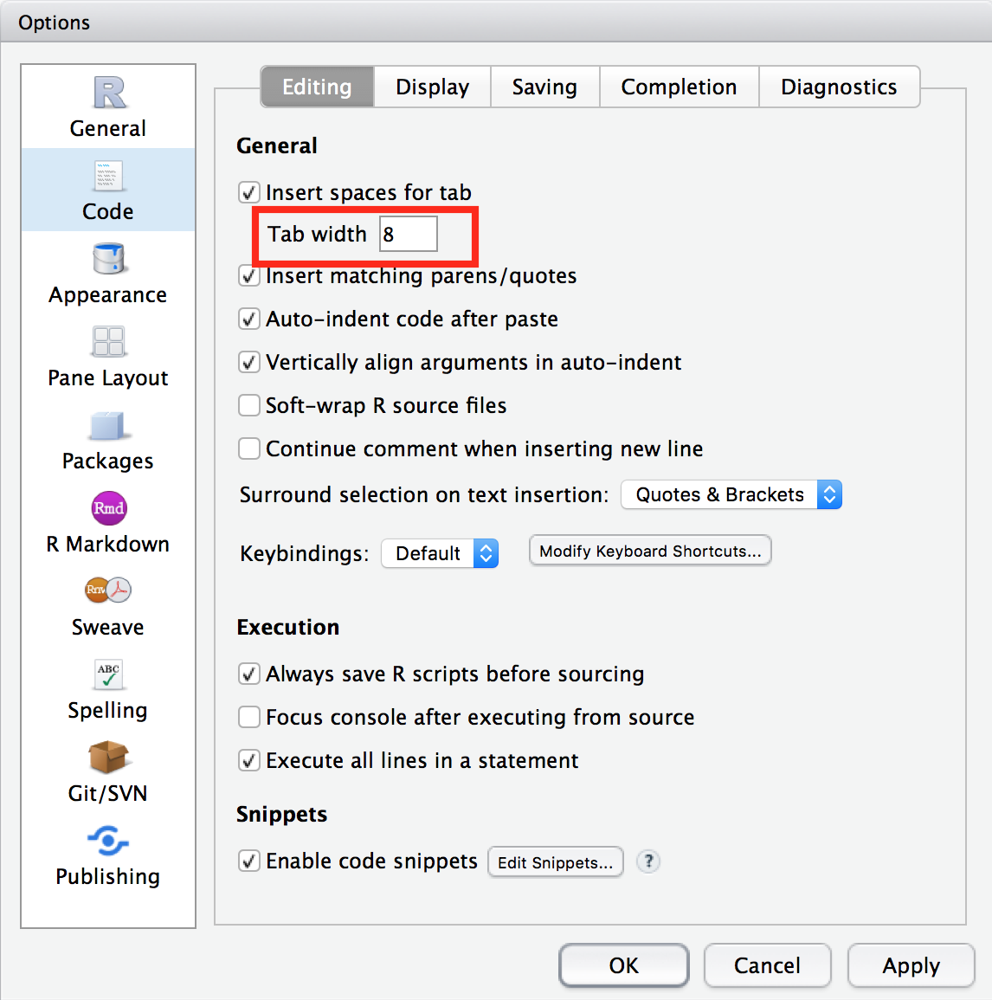
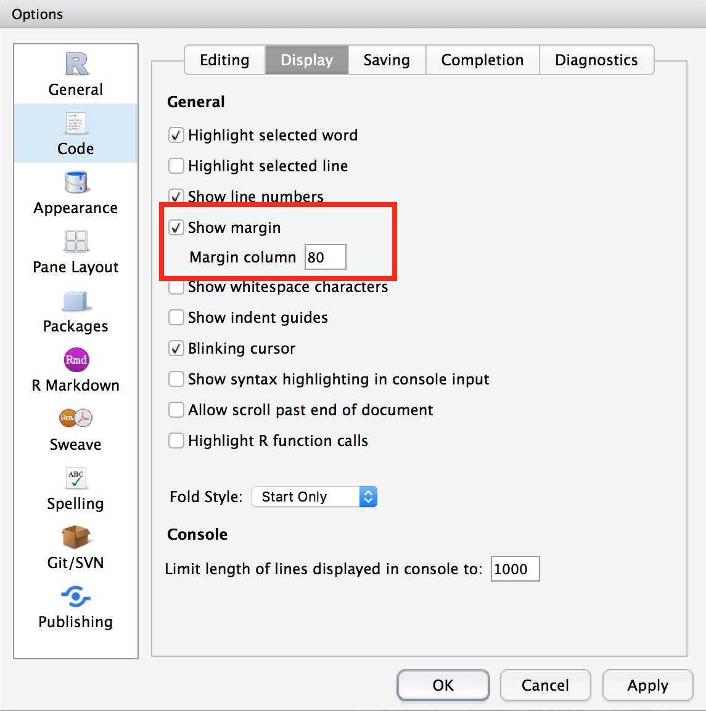

## Overview

> - Shiny Fundamentals
> - Reactive Programming
> - Shiny Modules

## Outline

> - Hour 0.5: intro, usecases and setup.
> - Hour 1.5: shiny fundamentals (UI & server, input & output, and themes).
> - Hour 3  : reactive programming.
> - Hour 4  : modules.

## Intro

---

## What is Shiny?

> - Shiny allows you to rapidly build web apps using R.
> - [Shinyapps.io](https://www.shinyapps.io) allows you to easily deploy these apps.

## Who is Shiny for?

> - Biostatisticians / Statisticians
> - Data scientists
> - R programmers

## Why should you care? 

- Improve productivity
- Broaden userbase
- Tell data stories
- Prototype
- Become shiny developers
- NOT hard

## Demo

---

## Simple usecases

1. Interactive plots. For example, a [bar chart](https://cabaceo.com/berkshire-vs-sp500/) that shows the actual values when you mouse over the bars. A [timeseries plot](https://cabaceo.com/shiller-pe/) that changes as you select different periods.

2. Turn your ideas into reality. For example, this [app](https://942kid.shinyapps.io/douban_explorer/) allows you to look up a user's most recent readings on Douban (豆瓣). Notice you can also embed google ads in the app. This [app](https://cabaceo.shinyapps.io/tabelog-en/) provides a cleaner interface to search restaurants on Tabelog in English. 

3. Embed data analysis in your blog post so that readers can play with the results. [Example](https://uasnap.shinyapps.io/ex_leaflet/).

## Complex usecases

1. Super easy to run calculations under different scenarios or statistical procedures with different input parameters. For example, [calculate sample sizes in multi-regional clinical trials](https://gmlang.shinyapps.io/SSCRC/).

2. Train and backtest various models, compare results and generate reports. For example, here's an [app](http://hdnom.io) that does all of that for survival models.

3. You can build an entire product/SaaS platform using Shiny. [Example](https://newsroom.ly).

4. [More](https://shiny.rstudio.com/gallery/) [examples](https://www.showmeshiny.com).

## Setup

---

## Install dev tools

> - [R](https://www.r-project.org)
> - [Rstudio](https://www.rstudio.com/products/rstudio/download/)
> - Web broswer (Safari, Chrome or Firefox)
> - Sign up for a FREE account at [shinyapps.io](http://www.shinyapps.io)

## Install R packages

```r
pkgs = c("shiny", "shinydashboard", "tidyverse", "plotly")
for (pkg in pkgs) {
        if (!pkg %in% installed.packages()) {
                cat(paste(pkg, "missing, will attempt to install\n"))
                install.packages(pkg)
        } else cat(paste(pkg, "installed OK\n"))
}
```

## Change Rstudio layout

Go to **Rstudio -> Preferences -> Pane Layout**. Change so it looks like this.


## Change tab width

Default is 2 spaces. Change to 8.



## Show margin line

Check **Show margin** and set **Margin column** to be 80.



## R code style

When naming an object in R,

> - names should be meaningful
> - use lower case 

```r
# Good: 
student <- 25
foo.R, 

# Bad:
Student <- 25
Foo.R
```

## R code style cont.

> - use _ to connect

```r
# Good: 
learn_shiny <- function(start, end)

# Bad: 
learnShiny<- function(start, end)
```

> - use verb to name a function

Homework: read the entire [R Style Guide](http://style.tidyverse.org/files.html).


## Hello World!

> - Click the arrow next to **Run App** -> check **Run in Viewer Pane** 

This will open the app inside Rstudio. If you want to open the app in browser,
check **Run External** instead.
> - Click **Run App**.

## Hello World! code

```r
library(shiny)

# make UI ---
ui <- fluidPage(
        titlePanel("Hello World!")
)

# make server ---
server <- function(input, output) {}

# make Shiny app ----
shinyApp(ui = ui, server = server)
```

## Introduce yourself

> - Add an input box to let people enter their names. 
> - Output a sentence to say hello to the world.

Run <font color="blue">examples/01-hello-world.R</font>.

## Code

```r
# make UI ---
ui <- fluidPage(
        titlePanel("Hello World!"),
        mainPanel(
                textInput("my_name", 
                          label = "Enter your name:", 
                          value = "Harry"),
                textOutput("self_intro")
        )
)

# make server ---
server <- function(input, output) {
        output$self_intro = renderText(
                paste("My name is", input$my_name)
        )
}
```

## Use sidebar 

Run <font color="blue">examples/01-hello-world-w-sidebar.R</font>

## Code

```r
ui <- fluidPage(
        titlePanel("Hello World!"),
        
        sidebarLayout(
                sidebarPanel(
                        textInput("my_name", 
                                  label = "Enter your name:", 
                                  value = "Harry")
                        ),
                
                mainPanel(
                        textOutput("self_intro")
                )
        )
        
)
```

## Basic structure of shiny app

---

## UI

- fluidPage()
    - sidebarLayout()
        - sidebarPanel()
            - textInput()
            - numericInput()
        - mainPanel()
            - textOutput()
            - plotOutput()


## server

```r
server <- function(input, output) {
        1. takes user supplied values from input
        2. run computation
        3. return or display results through output
            - renderText()
            - renderPlot()
}
```

## Exercise 1

Make a shiny app that 

> - draws a histogram of some made-up data, and
> - lets users specify the number of bins.

Open <font color = "red">exercises/01-plot-histogram.R</font>. The server
function is already completed. We need to finish the ui. 

## Exercise 2

Make a shiny app that 

> - draws a histogram of Petal.Length in the iris data, and 
> - lets user choose the number of bins using a slider (?sliderInput()) 

You have 6 minutes.

## Exercise 3

Make a shiny app that

> - adds a scatter plot of Sepal.Length vs Sepal.Width, and
> - adds a text input box to allow user to supply a plot title. 

You have 8 minutes.

## Deploy app


## Bigger shiny app file structure

---


## Example global.R snippet

```r
library(shiny)
library(shinyjs)
library(dplyr)
library(ggplot2)

# change max upload file size to 30 MB, default is 5 MB
options(shiny.maxRequestSize = 30*1024^2, shiny.reactlog = T)

# set paths
helper_path = "R/helper"
ui_path = "R/ui"
server_path = "R/server"

# load helper functions
for (fname in list.files(helper_path)) 
        source(file.path(helper_path, fname))
```

## Example ui.R snippet

```r
ui <- fluidPage(theme = "darkly.css", id = "navbar",
                     ...
     tabPanel(title = "Fake",
              uiOutput("hclust_filter"),        
              uiOutput("hclust_num"),
              actionButton("run_hclust", "Run"),
              plotOutput("dendrogram", height = "600px"),
              downloadButton('download_plt_hclust', "Download Plot")
     )
     ...
)
```

## Example server.R snippet

```r
server <- function(input, output) {
        # load ui related source files
        source(file.path(ui_path, "ui-simulate.R"), local=T)
        source(file.path(ui_path, "ui-simulate-allon-alloff-buttons.R"), local=T)
        
        # load server related source files
        source(file.path(server_path, "01-load-n-prep-data.R"), local=T)
        source(file.path(server_path, "02-simulate.R"), local=T)
}
```

## Include CSS and Javascript


## Break (5 minutes)


## Reactive Programming

---

## Exercise

>- Open the file <font color="blue">exercises/04-reactivity-00.R</font>
>- Complete the server function so the app plots the first nrows of `cars`. So basically, make the Shiny equivalent of `plot(head(cars, nrows))`.
> - 2 minutes

<font size=2>credit: [Joe Cheng](https://www.rstudio.com/resources/videos/effective-reactive-programming/)</font>

## Solution

```r
output$plot <- renderPlot({
        plot(head(cars, input$nrows))
})
```

## Terminologies

```r
output$plot <- renderPlot({
        plot(head(cars, input$nrows))
})
```

|           |Role             |Implementation (R)         |
|-----------|-----------------|---------------------------|
|input$nrows|Reactive source  |Reactive value             |
|output$plot|Reactive endpoint|Observer ( renderPlot({}) )|


## Example: Fibonacci

**Run** <font color="blue">examples/03-reactivity-fibonacci-slow.R</font>. 

**Run** <font color="blue">examples/03-reactivity-fibonacci-fast.R</font>. 

<font size=2>credit: [Reactivity - An overview](https://shiny.rstudio.com/articles/reactivity-overview.html)</font>

## Slower Version

```r
server <- function(input, output) {
        # run fib() twice 
        output$nth_fib <- renderText({ fib(input$n) })
        output$nth_fib_inv <- renderText({ 1 / fib(input$n) })
}
```

## Faster Version

```r
server <- function(input, output) {
        # only run fib() once
        current_fib <- reactive({ fib(input$n) })
        
        output$nth_fib <- renderText({ current_fib() })
        output$nth_fib_inv <- renderText({ 1 / current_fib() })
}
```

## Terminologies Table Update

```r
server <- function(input, output) {
        # only run fib() once
        current_fib <- reactive({ fib(input$n) })
        
        output$nth_fib <- renderText({ current_fib() })
        output$nth_fib_inv <- renderText({ 1 / current_fib() })
}
```

|             |Role              |Implementation (R)                   |
|-------------|------------------|-------------------------------------|
|input$nrows  |Reactive source   |Reactive value                       |
|current_fib()|Reactive conductor|Reactive expression ( reactive({}) ) |
|output$plot  |Reactive endpoint |Observer ( renderPlot({}) )          |

Source -> Conductor1 -> Conductor2 ... -> Endpoint

## Reactive Expression vs. Observer

|             |Reactive Expression |Observer             |
|-------------|--------------------|---------------------|
|R code       |`reactive({})`      |`observe({})`        |
|             |                    |`renderText({})`     |
|             |                    |`renderPlot({})`     |
|             |                    |`renderDataTable({})`|
|             |                    |...                  |

> - Reactive expression: always returns a value
> - Observer: never returns any values, instead, performs side effects

## Exercise 1

Open <font color="blue">exercises/04-reactivity-01.R</font>

Re-write the server logic to ensure `head()` is only run once for every
change to `input$nrows`.

> - 3 minutes

<font size=2>credit: [Joe Cheng](https://www.rstudio.com/resources/videos/effective-reactive-programming/)</font>

## Solution

```r
server <- function(input, output) {
        
        df <- reactive({
                head(cars, input$nrows)
        })
        
        output$plot <- renderPlot({
                plot(df())
        })
        
        output$table <- renderTable({
                df()
        })
}
```

## How does reactivity work?

```r
server <- function(input, output) {
        output$text <- renderText({
                print(input$a)
        })
}
```

## `print()`

```r
a = 50
print(a)

a = 75 # this action makes print(a) "out of date"

# to update "print(a)", just re-run it
print(a)
```

## Carrier pigeons


<font size=2>credit: [Rstudio](https://shiny.rstudio.com/articles/understanding-reactivity.html)</font>

## 


<font size=2>credit: [Rstudio](https://shiny.rstudio.com/articles/understanding-reactivity.html)</font>

## 


<font size=2>credit: [Rstudio](https://shiny.rstudio.com/articles/understanding-reactivity.html)</font>


## Exercise 2

Open <font color="blue">exercises/04-reactivity-02.R</font>

Run it and it works. The problem is that each of the 4 outputs contains 
copied-and-pasted logic for selecting the chosen variables, and for building
the model. Can you refactor the code so it's more efficient and maintainable?

>- 6 minutes

<font size=2>credit: [Joe Cheng](https://www.rstudio.com/resources/videos/effective-reactive-programming/)</font>

## Solution

```{r, eval=FALSE}
selected <- reactive({
        iris[, c(input$xcol, input$ycol)]
})

model <- reactive({
        lm(paste(input$ycol, "~", input$xcol), selected())
})
```

## Shiny Modules

---

## What is a function?
A bag of code. 

Takes some inputs and 

- returns something, or 
- performs some side effects, for example, `print()`, or
- does both.

## Why use functions?

> - isolate
> - re-use 

## What is a module?

2 functions: 

> - one creates UI elements
> - one defines server logic

## Example: slider


## Live Coding: write modules

Switch to Rstudio.

Work on the file <font color="blue">examples/06-modules-slider.R</font>.


## NS()

Adds a prefix to a string.

```{r, eval=F}
ns <- NS("hello")
ns("world")
# > [1] "hello-world"
ns("friend")
# > [1] "hello-friend"
```

##

Use `NS()` to create ids.
```{r, eval = F}
slider_ui <- function(id) {
        # id: string
        
        ns <- NS(id)
        tagList(
                sliderInput(ns("slider"), "Slide me", 0, 100, 1),
                textOutput(ns("num"))
        )
        
} 
```

## How to use module UI
```{r, eval = F}
ui <- fluidPage( slider_ui("a") )

server <- function(input, output) {}

shinyApp(ui, server)
```

## Module server

```{r, eval = F}
slider <- function(input, output, session) { # must have session
        output$num <- renderText({ input$slider })
}

slider_ui <- function(id) {
        ns <- NS(id)
        tagList(
                sliderInput(ns("slider"), "Slide me", 0, 100, 1),
                textOutput(ns("num"))
        )
} 
```


## How to use module server
```{r, eval = F}
ui <- fluidPage( slider_ui("a") )

server <- function(input, output) {
        callModule(slider, "a")
}

shinyApp(ui, server)
```

## Live Coding: use `NS()` to add 2 sliders

Switch to Rstudio.

Keep working on <font color="blue">examples/06-modules-slider.R</font>.


## Exercise 1

Use module to re-implement the hello-world example: <font color="blue">exercises/05-module-hello-world.R</font>.

## Exercise 2

You can now easily add multiple input boxes to your app. Try to add 3 of them.

## Where to define modules?


## Where to go next?

---

## Resources

> - [R style guide](http://style.tidyverse.org).
> - Rstudio's guided [tutorial](https://shiny.rstudio.com/tutorial/) for beginners.
> - Rstudio's technical [articles](https://shiny.rstudio.com/articles/).
> - [Shiny github page](https://github.com/rstudio/shiny).
> - [Shiny Google group](https://groups.google.com/forum/#!forum/shiny-discuss).
> - [>100 shiny app examples with code](https://github.com/rstudio/shiny-examples).
> - [Shiny developer conference videos 2016](https://www.rstudio.com/resources/webinars/shiny-developer-conference/).
> - [Shiny Modules](https://shiny.rstudio.com/articles/modules.html)
