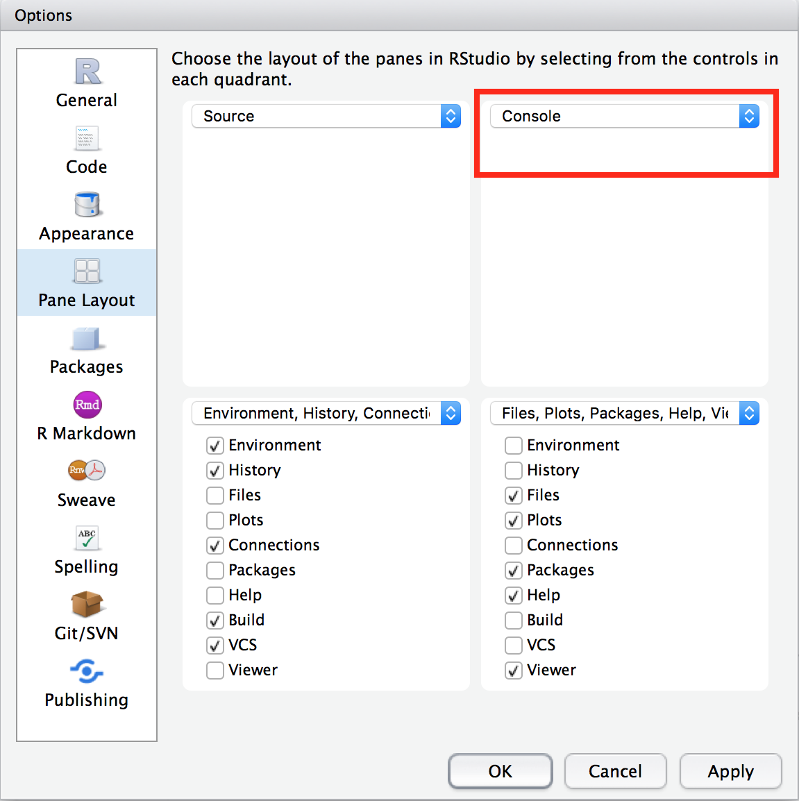

# Overview

## Goals | You will learn:

> - Shiny Fundamentals
> - Reactive Programming
> - Shiny Modules

## Outline

> - Hour 0.5: intro, usecases and setup.
> - Hour 1.5: shiny fundamentals (UI & server, input & output, and themes).
> - Hour 3  : reactive programming (the most important thing).
> - Hour 4  : modules (code re-use).


# Intro

## What?

> - Shiny allows you to rapidly build web apps using R.
> - [Shinyapps.io](https://www.shinyapps.io) allows you to easily deploy these apps.

## Who? 

> - Biostatisticians & Statisticians
> - Data scientists
> - R programmers

## Why? 

- Improve productivity. (Shiny allows you and your team to re-run calculation procedures by clicking buttons instead of running R scripts. It's easier to share an URL than a bunch of R files.)
- Let non-technical people use your models without knowing R. 
- Tell your data stories to the world. (Shiny supports powerful visualizations. Most shiny apps you make are mobile friendly by default.)
- Build minimum viable products.
- New career as Shiny developers.
- Not hard & fun.


# Demo

## Simple examples

1. Interactive plots. For example, a [bar chart](https://cabaceo.com/berkshire-vs-sp500/) that shows the actual values when you mouse over the bars. A [timeseries plot](https://cabaceo.com/shiller-pe/) that changes as you select different periods.

2. Turn your ideas into reality. For example, this [app](https://942kid.shinyapps.io/douban_explorer/) allows you to look up a user's most recent readings on Douban (豆瓣). Notice you can also embed google ads in the app. This [app](https://cabaceo.shinyapps.io/tabelog-en/) provides a cleaner interface to search restaurants on Tabelog in English. 

3. Embed data analysis in your blog post so that readers can play with the results. [Example](https://uasnap.shinyapps.io/ex_leaflet/).

## Complex examples

1. Super easy to run calculations under different scenarios or statistical procedures with different input parameters. For example, [calculate sample sizes in multi-regional clinical trials](https://gmlang.shinyapps.io/SSCRC/).

2. Train and backtest various models, compare results and generate reports. For example, here's an [app](http://hdnom.io) that does all of that for survival models.

3. You can build an entire product/SaaS platform using Shiny. [Example](https://newsroom.ly).

4. [More](https://shiny.rstudio.com/gallery/) [examples](https://www.showmeshiny.com).

## What again?

Shiny = statistical (R) programming + web technologies. 

It allows statisticians who don't know web technologies to easily make and publish interactive web apps. 

# Setup

## Install dev tools

> - [R](https://www.r-project.org)
> - [Rstudio](https://www.rstudio.com/products/rstudio/download/)
> - Web broswer (Safari, Chrome or Firefox)
> - Sign up for a FREE account at [shinyapps.io](http://www.shinyapps.io)

## Change Rstudio layout

> - Go to **Rstudio -> Preferences -> Pane Layout**
> - Change to as shown below. 



## Change tab width

> - Default is 2 spaces. Change to 8.
> - This will force you to write shorter code.


## Show margin line

> - Check **Show margin** and set **Margin column** to be 80.
> - When writing code, never go beyond this margin line. 
> - This will make your code easier to read.


## R code style

When naming, 

> - names should be meaningful
> - use lower case 

```{r, eval=FALSE}
# Good: 
student <- 25
foo.R, 

# Bad: because of Uppercased 1st letter
Student <- 25
Foo.R
```

## R code style cont.

> - use _ to connect

```{r, eval=FALSE}
# Good: 
learn_shiny <- function(start, end)

# Bad: because of camelCase 
learnShiny<- function(start, end)
```

> - use verb to name a function

[R Style Guide](http://style.tidyverse.org/files.html)

## Install R packages

```{r, eval=FALSE}
pkgs = c("shiny", "shinydashboard"
         # , "plotly"
         )
for (pkg in pkgs) {
        if (!pkg %in% installed.packages()) {
                cat(paste(pkg, "missing, will attempt to install\n"))
                install.packages(pkg)
        } else cat(paste(pkg, "installed OK\n"))
}
```

## Hello, World!

Open <font color="blue">examples/00-hello-world-boring.R</font> in Rstudio.

> - Click the arrow next to **Run App** -> check **Run External** (This will open the app in browser.)


Click **Run App**.

## Read code

```{r, eval=FALSE}
library(shiny)

# make UI ---
ui <- fluidPage(
        titlePanel("Hello World!")
)

# make server ---
server <- function(input, output) {}

# make Shiny app ----
shinyApp(ui = ui, server = server)
```

## Introduce yourself

> - Add an input box to let people enter their names. 
> - Output a sentence to say hello to the world.

Run <font color="blue">examples/01-hello-world.R</font>

## Read code

```{r, eval=FALSE}
# make UI ---
ui <- fluidPage(
        titlePanel("Hello World!"),
        ###<b>
        mainPanel(
                textInput("my_name", 
                          label = "Enter your name:", 
                          value = "Harry"),
                textOutput("self_intro")
        )
        ###</b>
)

# make server ---
server <- function(input, output) {
        ###<b>
        output$self_intro = renderText(
                paste("My name is", input$my_name)
        )
        ###</b>
}
```

## Use sidebar 

Run <font color="blue">examples/01-hello-world-w-sidebar.R</font>

```{r, eval=FALSE}
ui <- fluidPage(
        titlePanel("Hello World!"),
        ###<b>
        sidebarLayout(
                sidebarPanel(
                        textInput("my_name", 
                                  label = "Enter your name:", 
                                  value = "Harry")
                        ),
                
                mainPanel(
                        textOutput("self_intro")
                )
        )
        ###</b>
)
```


## Exercise 1

> - Make a shiny app that draws a histogram of some made-up data, letting users specify the number of bins.

Complete <font color = "red">exercises/01-plot-histogram.R</font> together.


## Basic structure of Shiny App

### UI:
- fluidPage()
    - sidebarLayout()
        - sidebarPanel()
        - mainPanel()

### server:
- renderText()
- renderPlot()

## UI 

### Input elements (inside of **sidebarPanel()**):
- textInput()
- numericInput()

### Output elements (inside of **mainPanel()**):
- textOutput()
- plotOutput()

## server
```{r, eval=FALSE}
server <- function(input, output) {
        1. takes user supplied values from input
        2. run computation
        3. return or display results through output
}
```

## Exercise 2

> - Make a shiny app that draws a histogram of Petal.Length in the iris data. Use a slider input to let user choose the number of bins.
> - ?sliderInput()
> - 5 ~ 10 minutes

## Exercise 3

> - Add a scatter plot of Sepal.Length vs Sepal.Width. Add a text input box to let user supply a plot title. 
> - 5 ~ 10 minutes

## Deploy Shiny App

> - Click the blue button.


 
## Break (5 minutes)


# Bigger Shiny Apps 

## ui.R & server.R


# Reactive Programming

## What is Reactivity?

The Server keeps monitoring the UI. Whenever there is a change in the UI, the Server will follow some instructions (run some R code) accordingly and update the UI's display.


# Modules

## Placeholder


# Where to go next?

## Resources

- [R style guide](http://style.tidyverse.org).
- Rstudio's guided [tutorial](https://shiny.rstudio.com/tutorial/) for beginners.
- Rstudio's technical [articles](https://shiny.rstudio.com/articles/).
- [Shiny github page](https://github.com/rstudio/shiny).
- [Shiny Google group](https://groups.google.com/forum/#!forum/shiny-discuss).
- [>100 shiny app examples with code](https://github.com/rstudio/shiny-examples).
- [Shiny developer conference videos 2016](https://www.rstudio.com/resources/webinars/shiny-developer-conference/).
